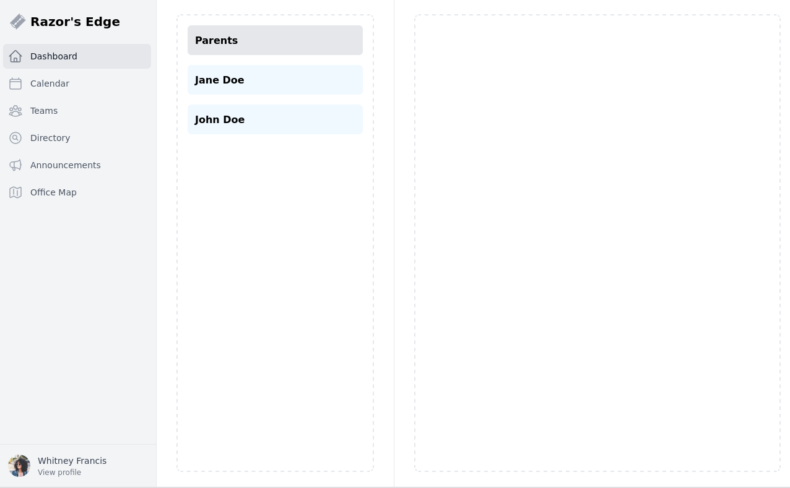
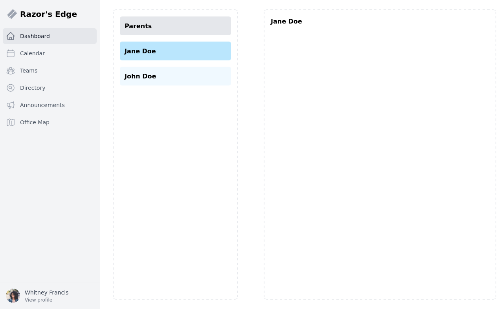

# Parent / Child views using ASP.NET Razor Fragments 

Example implementation of the [razor fragments approach](https://alexanderzeitler.com/articles/htmx-razor-fragment-single-view-approach/) with a parent / child view served from a single Razor view file.

**List view**


**Details view**


## Usage

```bash
yarn
cd src/RazorSectionsLayouts
yarn
libman restore
cd ../..
yarn start
```

Browse http://localhost:5000/home/list